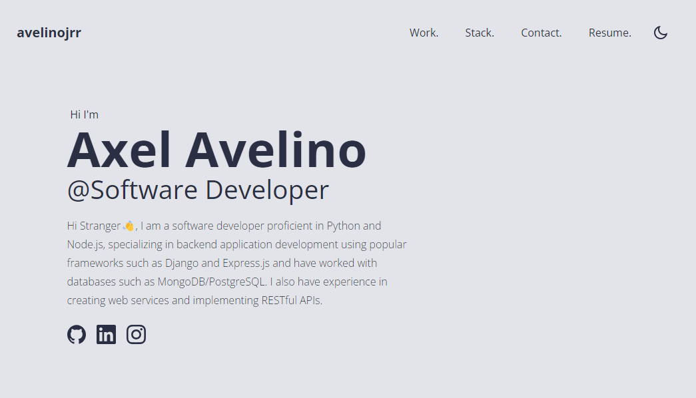

<div id="top"></div>


# avelinojrr
avelinojrr is my portfolio built with full React and Vite, super simple. 



[Live Preview](https://axelavelino.me)


## Prerequisites

Install NPM or PNPM
* npm
  ```sh
  npm install npm@latest -g
  ```
 
  Or
  
* pnpm
  ```sh
  npm install -g pnpm
  ```


## Setup

1. Clone the repo
   ```sh
   git clone https://github.com/avelinojrr/AP
   ```
   
2. Install NPM packages
   ```sh
   npm install
   ```
   
3. Start the development server
   ```sh
   npm run dev
   ```

## Usage

* Open the file `index.html` and replace `<title>avelinojrr</title>` with `<title>Your Name</title>`
* Open the file `src/data.js` and make changes.


## Build & deploy

1. Generate a full static production build
   ```sh
   npm run build
   ```
   
2. Preview the site as it will appear once deployed
   ```sh
   npm run preview
   ```

## License

Distributed under the MIT License. See `LICENSE.txt` for more information.

<p align="right">(<a href="#top">back to top</a>)</p>
